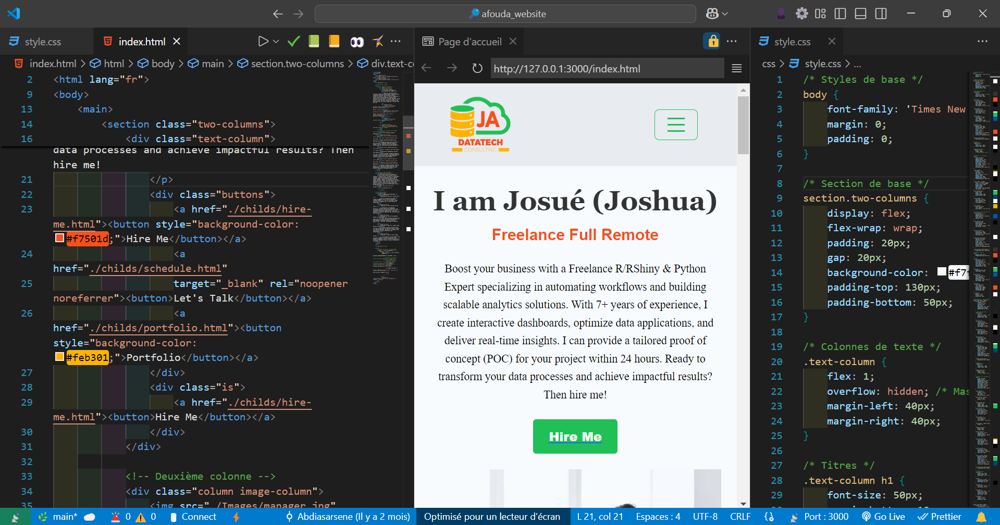

# Portfolio of Josué AFOUDA - Data Scientist

Welcome to Josué AFOUDA's portfolio! This website presents Josué AFOUDA's skills and projects as a Freelance Expert in R/RShiny & Python, specialized in workflow automation and the creation of scalable analytical solutions.

## My Portfolio

Welcome to my portfolio! This website presents my skills and projects as a Freelance Expert in R/RShiny & Python, specialized in workflow automation and the creation of scalable analytical solutions.

## Overview

This portfolio project was designed to showcase my achievements and invite visitors to collaborate with me. The site is divided into several sections:

- **About**: A brief introduction about me and my skills.
- **Projects**: A presentation of my projects with descriptions and links for more details.
- **Contact**: A form to get in touch with me.

## Technologies Used

This portfolio was built using the following technologies:

- HTML5
- CSS3

## Installation

To view this project locally, follow the steps below:

1. Clone this repository to your local machine:

git clone https://github.com/Abdiasarsene/joshua_website.git
